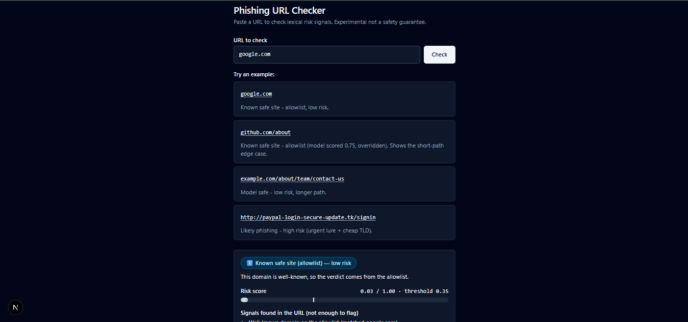
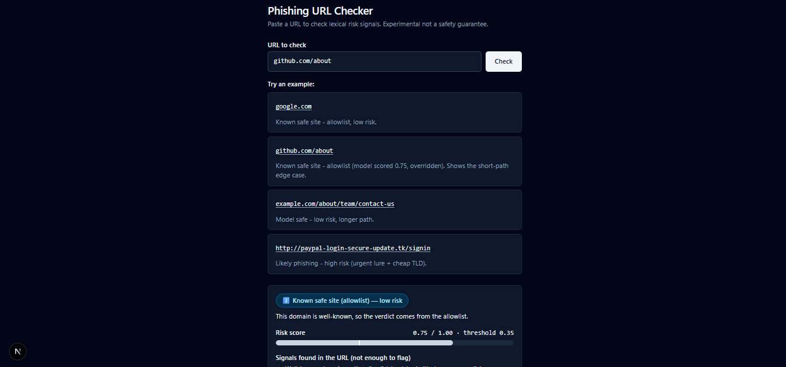
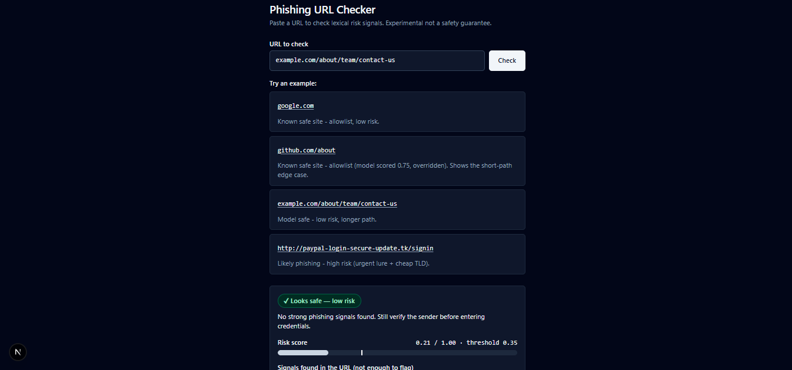
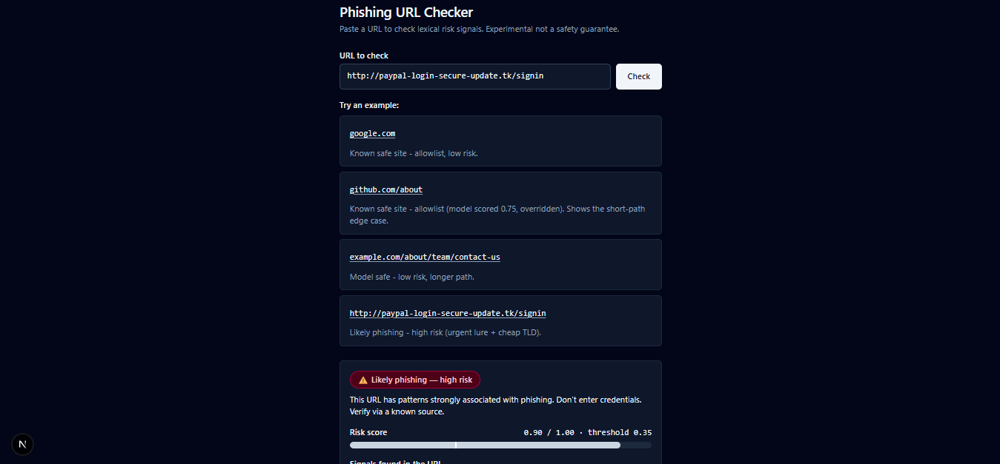
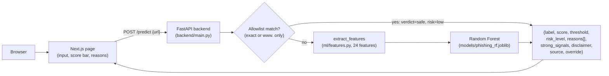

# URL Phishing Detection System

Paste a URL, get a phishing verdict with human-readable reasons. A local full-stack app: a scikit-learn Random Forest scores lexical URL signals behind a FastAPI backend, a small offline allowlist protects well-known domains from model false positives, and a single Next.js + TypeScript page shows the verdict, risk score, risk level, and reasons. Experimental a lexical heuristic, not a safety guarantee.

## Screenshots



Model safe - low risk on a longer-path URL.



Suspicious - medium-risk model verdict with no single strong signal.



Known safe site - allowlist verdict, low risk.



Likely phishing - high risk with strong signals (urgent lure + cheap TLD).

## Architecture



One rule shapes the whole design: feature extraction lives only in `ml/features.py` and is shared by training and the API — no duplicated feature logic. Every prediction returns human-readable `reasons[]` derived from the same feature vector the model saw.

## Quick start

Run everything from the repo root. Toolchain: Python 3.13.0 in `.venv/` (see `AGENTS.md`).

**1. Get the dataset.** Download the Kaggle "Phishing Site URLs" dataset and place the raw CSV at `ml/data/phishing_site_urls.csv` (columns `xURL`, `Label`; never modified by the pipeline). Datasets, `.env` files, and `*.joblib` artifacts stay local-only and are never committed — except the small deploy model `models/phishing_rf.joblib` (tracked via `!models/phishing_rf.joblib` in `.gitignore`).

**2. Clean the data** (`ml/data/phishing_site_urls.csv` → `ml/data/clean.csv` with columns `url`, `label`):

```bat
.\.venv\Scripts\python.exe ml/clean.py
```

**3. Train** (needs `ml/data/clean.csv`; writes `models/phishing_rf.joblib` (git-ignored) + `models/metrics.json` (tracked)):

```bat
.\.venv\Scripts\python.exe ml/train.py
```

Deploy note: the tracked `models/phishing_rf.joblib` is the small
deploy model for a 512 MB host (60 trees, `max_depth` 24,
`min_samples_leaf` 10, thr 0.38, 12.63 MB — see the `deploy` entry in
`models/metrics.json` and the table in `docs/known_limitations.md`).
The previous artifact is kept locally as
`models/phishing_rf_full.joblib` (git-ignored backup). Retraining with
`ml/train.py` overwrites the deploy file with the full-size model.

**4. Start the backend** (needs `models/phishing_rf.joblib` — run `ml/train.py` first):

```bat
.\.venv\Scripts\python.exe -m uvicorn backend.main:app --reload --port 8000
```

Backend env (all optional):

- `MODEL_PATH` (default `models/phishing_rf.joblib`) — overrides the model artifact location.
- `ALLOWED_ORIGINS` (comma-separated, default `http://localhost:3000`) — CORS allow-list; in production set it to your frontend origin, e.g. `ALLOWED_ORIGINS=https://your-app.vercel.app`.

Inference runs single-threaded (`model.n_jobs = 1`) for stable free-tier hosting.

**5. Start the frontend** (from the repo root; API base from `NEXT_PUBLIC_API_URL`, default `http://localhost:8000`):

```bat
cd frontend
npm install
npm run dev
```

Open http://localhost:3000. See `frontend/.env.example` for the API URL variable. Frontend env:

- `NEXT_PUBLIC_API_URL` (default `http://localhost:8000`) — API base used for `POST /predict` and the background `GET /health` warm-up ping.

**6. Run the tests:**

```bat
.\.venv\Scripts\python.exe -m pytest tests -v
```

## API reference

Base URL: `http://localhost:8000` (or `NEXT_PUBLIC_API_URL`).

### `POST /predict`

Request: `{ "url": string }`

Response: `{label, score, threshold, risk_level, reasons[], strong_signals, disclaimer, source, override}` — `label` is `safe` | `phishing`, `risk_level` is `low` | `medium` | `high`, `source` is `model` | `allowlist`. `reasons[]` is always present and human-readable. On the allowlist path the verdict is `safe` with `risk_level` low; the model score and model reasons are still returned for transparency, with `override: true` when the model had voted phishing. `strong_signals` is true when at least one strong reason fired on the model path (fallback text and allowlist routing notes never count). Errors: `422 + {detail}` on garbage/empty/oversize URLs (max 2048 chars), `413` on bodies over 4 KB. The frontend uses a 75 s fetch timeout for `POST /predict` (free-tier cold starts can be slow) and reports network failure as API-down. On page load it also fires a background `GET /health`; if that ping is still pending after 3 s it shows "The server is waking up (free hosting sleeps when idle). The first check can take up to a minute."

Sample response shape (phishing-style URL, threshold from the shipped model):

```json
{
  "label": "phishing",
  "score": 0.9,
  "threshold": 0.35,
  "risk_level": "high",
  "reasons": [
    "Contains urgent lures like 'verify' or 'login'.",
    "Uses a cheap top-level domain often abused for throwaway phishing sites."
  ],
  "strong_signals": true,
  "disclaimer": "Lexical heuristic only, not a safety guarantee. The score is the share of model trees voting phishing, not a calibrated probability.",
  "source": "model",
  "override": false
}
```

(The score above is the approximate value (`~0.90`) recorded for the `paypal-login-secure-update.tk/signin` probe in `DESIGN.md`; the exact score may shift slightly after retraining. Never display the score as "% probability" — only as a "Risk score" bar, `0.72 / 1.00`-style.)

### `GET /health`

Returns whether the service is up and the model is loaded:

```json
{ "status": "ok", "model_loaded": true }
```

### `GET /metrics`

Returns the full tracked `models/metrics.json` document (splits, per-version test metrics, confusion matrices, feature importances, bare-host slice, probe results). Returns `503 + {detail}` when metrics are unavailable (train first).

## ML pipeline

**Cleaning (`ml/clean.py`).** Raw `ml/data/phishing_site_urls.csv` is read-only (hashed before/after to prove it was not modified). Steps: rename `xURL` → `url`; map labels `good` → 0 (legit), `bad` → 1 (phishing), failing loudly on anything unexpected; strip whitespace; drop empty URLs; drop exact duplicate rows; drop *all* rows for URLs with conflicting labels.

**Features (`ml/features.py`, 24 features).** The single source of truth used by both training and the API: lengths (`url_len`, `host_len`, `path_len`), counts (`num_dots`, `num_hyphens`, `num_underscores`, `num_digits`, `num_specials`), binary signals (`has_at`, `has_ip`, `has_suspicious_word`, `has_punycode`, `has_percent_encoding`), ratios/entropy (`digit_ratio`, `letter_ratio`, `host_entropy`, `path_entropy`), structure (`path_depth`, `num_query_params`, `longest_token_len`, `num_subdomains`, `has_risky_ext`), and reputation-style flags (`has_suspicious_tld` from a fixed cheap-TLD list, `brand_mismatch` for a trusted brand in the subdomain/path but not the registrable domain). `reasons_from_features()` turns the same vector into plain-English reasons, always returning at least one.

**Why scheme is excluded.** Only 107 of 549k dataset URLs carry a scheme, so the model cannot learn anything reliable about HTTPS. `extract_features` strips one leading `http://`/`https://` before computing anything, there is no `uses_https` feature, and predictions are scheme-invariant by construction.

**Grouped split.** Train/val/test split happens before fitting, grouped by registrable domain so the same domain never appears in more than one set (asserted in code). Same seeds across versions (split seeds 42/43, model seed 42), giving train 301156 / val 107936 / test 98097 rows per `models/metrics.json`.

**Threshold tuning.** The operating threshold is tuned on validation only: the highest threshold with val phishing-recall at or above target (0.92 for v2/v3; 0.90 for v1). Result: threshold 0.33 for v1, 0.35 for v2 and v3. Headline metrics below are the held-out test numbers at those tuned thresholds.

**v1 vs v2 vs v3 (test set, val-tuned thresholds — from `models/metrics.json` / `models/metrics_v2.json` only, phishing class, rounded to 4 decimals):**

| version | threshold | accuracy | precision | recall | F1 |
|---|---:|---:|---:|---:|---:|
| v1 RF | 0.33 | 0.7389 | 0.4656 | 0.8866 | 0.6105 |
| v2 RF (selected) | 0.35 | 0.8007 | 0.5407 | 0.9070 | 0.6775 |
| v3 RF (shipped) | 0.35 | 0.7939 | 0.5314 | 0.9074 | 0.6703 |

v1 used the first feature set; v2 added 10 features (ratios, entropy, depth, query params, long tokens, risky extensions, suspicious TLDs, brand mismatch) and compared RF against XGBoost, selecting RF; v3 kept the v2-RF setup and added bare-host legit augmentation to train/val only (test untouched). The full document nests the v1 and v2 blocks inside `models/metrics.json` for history; `models/metrics_v2.json` is the frozen v1+v2 snapshot.

## Problems I found and fixed

- **Label leak via scheme.** The dataset has almost no scheme information, so any scheme-based feature would be noise at best and a leak at worst. Fixed by stripping `http(s)://` before featurization and excluding `uses_https` from the model entirely.
- **Duplicates and conflicting labels.** The raw feed contains exact duplicate rows and URLs labeled both ways. `ml/clean.py` drops exact duplicates and removes every row for any URL with conflicting labels instead of guessing.
- **Bare-domain shortcut.** The legit and phishing rows come from different sources: legit rows are mostly full URLs with paths while phishing feeds list many bare domains, so v2 learned "no path = phishing" and flagged ~100% of bare-legit test hosts. v3 augments train/val (post-split, same groups) with bare-host variants of legit rows; this fixed bare-legit false positives but overcorrected — v3 catches only a fraction of bare-phishing hosts. Both directions are measured in `docs/known_limitations.md`, and `tests/test_bare_hosts.py` tracks the short-path case as `xfail(strict=True)` until fixed.
- **Allowlist layer.** Short paths like `/about` score as phishing even on well-known domains, and no host signal in the 24 features overrides that — so the backend checks an offline allowlist (`backend/allowlist.txt`, exact host or `www.` only, never arbitrary subdomains) before trusting the model, returning the model score and reasons anyway for transparency.
- **Strong vs weak signals.** Not all reasons are equal: IP-as-host, `@`, punycode, urgent lure words, suspicious TLD, and brand mismatch are strong; lengths, counts, entropy, tokens, depth, params, risky extensions, and percent-encoding are weak. Threshold validation (`docs/threshold_validation.md`) removed the `num_hyphens` and `num_underscores` reasons after they fired more on legit than phishing, and flagged `has_risky_ext` as the noisiest kept reason. The UI only says "Likely phishing" for high-risk model verdicts *with* strong signals; anything else model-flagged is "Suspicious".

## Limitations

Stated plainly, from `docs/known_limitations.md`:

- **Headline metrics overstate real-world performance.** The test numbers above measure URL-structure separation on this dataset's split, not phishing-detection ability in the wild. Treat them as comparative, not as a safety guarantee.
- **URL text only.** Lexical signals can't see page content, hosting reputation, or freshly registered domains with clean-looking URLs, and miss new or short-lived phishing domains.
- **Dataset bias.** Legit and phishing rows come from different sources, so part of every score reflects URL structure, not intent.
- **Bare-host blind spot.** On a 43,414-unique-test-host bare slice, v2 flagged ~100% of bare-legit hosts; v3 fixed that but now misses most bare-phishing hosts (augmentation overcorrected toward "bare = legit").
- **Short-path false positives.** `/about` and `/login` score as phishing even on well-known domains (`google.com/about`, `github.com/about`, `wikipedia.org/about` all score above the 0.35 threshold). The allowlist covers exact/`www.` well-known hosts, but subdomains of allowlisted domains always go to the model by design, and `docs.google.com` is deliberately not allowlisted (forms are widely abused).
- **Allowlist ≠ safe page.** An allowlist match means the domain is well-known; it does not guarantee the specific page is safe — legitimate sites can be compromised.

## Project structure

```text
ml/clean.py          raw ml/data/phishing_site_urls.csv -> ml/data/clean.csv (url, label)
ml/features.py       the only feature logic: extract_features + reasons_from_features + reason_strength
ml/train.py          featurize (cached in ml/data/features.csv) -> grouped split -> train RF -> metrics
ml/data/             raw + clean.csv + feature cache (local-only)
models/              phishing_rf.joblib (tracked deploy model, 12.63 MB) + phishing_rf_full.joblib (local-only backup) + metrics.json / metrics_v2.json (tracked)
backend/main.py      FastAPI: POST /predict, GET /health, GET /metrics
backend/allowlist.txt  offline well-known-domain list (exact or www. matching only)
frontend/            Next.js + TypeScript one-page checker (app, components, lib/api.ts)
tests/               test_features.py, test_api.py, test_bare_hosts.py
docs/                known_limitations.md, probe_set.md, threshold_validation.md, screenshots/
```

## Dataset credit

URLs and labels come from the Kaggle "Phishing Site URLs" dataset, placed locally at `ml/data/phishing_site_urls.csv` and cleaned to `ml/data/clean.csv` (`url`, `label`: 0 = legit, 1 = phishing). The 90-URL probe set in `docs/probe_set.md` (30 well-known bare + 30 well-known with `/about` + 30 phishing-style) is hand-made, biased by construction, and used as a sanity check only — never tuned on, never a benchmark.

## Roadmap — NOT built yet

The following are explicitly out of scope for this version (per `PRD.md`/`TASKS.md`) and do **not** exist in this repo: a **Chrome extension**, per-user **history** / login, and a **dashboard** (along with MongoDB persistence and XGBoost as the shipped model — XGBoost was evaluated in v2 but RF was selected). Next model work is the open `xfail` short-path/bare-host problem, not new surfaces.
